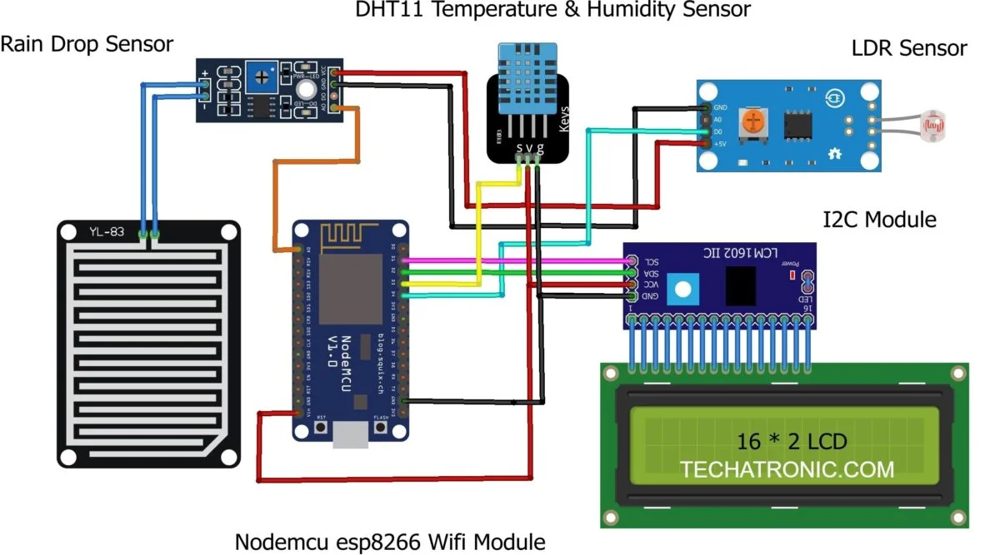
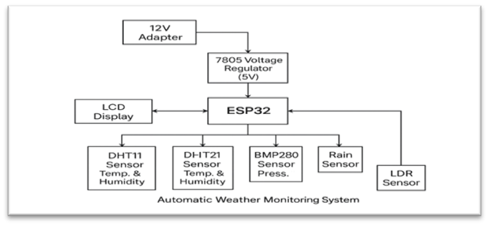

# 🌦️ IoT-Based Weather Monitoring System (Hardware Only)

This project is a **hardware-only** IoT-based weather monitoring system using an ESP32 microcontroller and basic sensors. It displays real-time weather parameters on an I2C-enabled 16x2 LCD.

---

## 📌 Project Objectives

- Monitor temperature, humidity, pressure, light intensity, and rainfall
- Display real-time data on an LCD screen
- Create a cost-effective, energy-efficient, and expandable system
- Suitable for rural/remote weather tracking, agriculture, and educational projects

---

## 🧰 Hardware Components

| Component                        | Function                                          |
|----------------------------------|---------------------------------------------------|
| **ESP32**                       | Microcontroller with Wi-Fi and ADC                |
| **DHT11**                       | Temperature & Humidity Sensor                     |
| **BMP280**                      | Pressure & Altitude Sensor                        |
| **Rain Sensor**                 | Detects rainfall using resistance change          |
| **LDR (Light Dependent Resistor)** | Measures ambient light                        |
| **16x2 LCD (I2C)**              | Displays live sensor data                         |
| **7805 Voltage Regulator**      | Converts 12V to 5V for ESP32/sensors              |
| **12V Adapter**                 | Powers the whole system                           |

---

## 🌐 Applications of IoT-Based Weather Monitoring System

- **🌾 Agriculture Monitoring**: Helps farmers monitor real-time environmental conditions to improve crop yield and irrigation scheduling.
- **🏠 Home Weather Station**: Allows individuals to track local weather from their home using a low-cost and reliable setup.
- **⚠️ Disaster Preparedness**: Provides early warnings for rainfall, pressure drops, and temperature spikes that may signal floods or storms.
- **🔬 Environmental Research**: Useful for researchers collecting long-term weather and climate data in remote or experimental locations.
- **🏙️ Smart City Infrastructure**: Enables integration into urban IoT networks for city-level data collection and analysis, aiding traffic, pollution, and emergency services.

---

## 🛠️ Wiring Overview

> Refer to `circuit_diagram/image.png` for complete connection details.

Sample connections:
- **DHT11** → Digital pin (e.g., D4)
- **BMP280 (I2C)** → SDA, SCL (e.g., D21, D22)
- **Rain sensor** → Analog pin (e.g., A0)
- **LDR** → Voltage divider + Analog pin (e.g., A1)
- **LCD (I2C)** → SDA, SCL
- **Power** → 12V → 7805 → 5V to ESP32

---

## 🚀 How to Use

1. Clone the repository:
   ```bash
   git clone https://github.com/Subhadip-chattaraj/iot-weather-monitoring-hardware.git
   ```

2. Open `firmware/esp32_weather_monitor.ino` in Arduino IDE

3. Install required libraries:
   - `Blynk by Volodymyr Shymanskyy`

   - `DHT sensor library by Adafruit`

   - `Adafruit Unified Sensor (dependency for DHT)`

   - `LiquidCrystal_I2C by Frank de Brabander or Marco Schwartz`

   - `ESP32 Board Package by Espressif Systems (install via Board Manager)`

4. Select Board: `ESP32 Dev Module`

5. Upload code and connect hardware

---

## 📷 Circuit Diagram

>

---

## 📷 Block Diagram

>

---

<h3>📹 Demo Video</h3>

<video width="640" controls>
  <source src="assets/video.mp4" type="video/mp4">
  Your browser does not support the video tag.
</video>


---

## 🧪 Testing

A series of tests were conducted to ensure the system's functionality, security, reliability, power efficiency, and connectivity. Below is a detailed summary:

### 1. ✅ Functionality Test

- **Sensor Readings**  
  - The **DHT11** and **DHT21** sensors accurately measure temperature and humidity with readings within **±2%** of expected values.  
  - The **BMP280** sensor provides precise atmospheric pressure readings within **±1 hPa**.  
  - The **Rain Sensor** reliably detects rainfall events.  
  - The **LDR** sensor consistently measures light intensity under varying lighting conditions.

- **LCD Display**  
  - The **16x2 LCD** correctly displays real-time values such as:
    ```
    Temp: 25°C, Hum: 60%, Press: 1013 hPa
    ```
  - Status updates like `"Rain Detected"` are shown promptly and clearly.

- **Mobile App Integration**  
  - The **ESP32** transmits data seamlessly over Wi-Fi.  
  - The app mirrors the LCD readings in real-time with no noticeable delay.

### 2. 🔒 Security Test

- **Data Transmission**  
  - Encrypted Wi-Fi communication prevents unauthorized interception of weather data.

- **Power Stability**  
  - The **7805 regulator** maintains a consistent 5V output throughout operation.

### 3. 🔁 Reliability Test

- **Continuous Operation**  
  - 24-hour continuous test showed consistent operation and stable sensor readings.

- **Environmental Resilience**  
  - The system operates effectively outdoors, enduring variable temperature and rainfall conditions.

### 4. ⚡ Power Consumption Test

- **Standby Mode**  
  - ESP32 uses **<50mA** in sleep mode, preserving power.

- **Active Mode**  
  - Draws **~100mA** during sensing and Wi-Fi transmission.

### 5. 🌐 Connectivity Test

- **Wi-Fi Stability**  
  - Maintains stable Wi-Fi connection with **<1% packet loss** during 12-hour test.

- **RTC Accuracy**  
  - Keeps time accurately with **<1 second** drift in 24 hours.

---

---

## 🙌 Contributors

- Tamajit Hazra 
- Pooja Yadav 
- Subhadip Chattaraj 
- Sayantan Mukharjee 

---

## 📍 Institution

**Asansol Engineering College**  
Department of Electronics and Communication Engineering  
Affiliated to MAKAUT

---

## ✅ Conclusion

The **Automatic Weather Monitoring System**, developed using the **ESP32 microcontroller**, successfully integrates multiple sensors—**DHT11**, **DHT21**, **BMP280**, **Rain Sensor**, and **LDR**—to provide **real-time weather data**, including temperature, humidity, atmospheric pressure, rainfall, and light intensity.

The system’s **dual-display feature**, with a **16x2 LCD** and **mobile app** via Wi-Fi, ensures both **local and remote monitoring**. Testing validated its stability and performance as of **11:42 PM IST on Wednesday, June 18, 2025**.

The **7805 voltage regulator** and **solar panel** offer a reliable power solution, supporting robust sensor operation and connectivity. This project successfully meets its design goals and offers impactful applications in:

- 🌾 Agriculture
- 🏠 Home automation
- ⚠️ Disaster preparedness
- 🔬 Environmental research
- 🏙️ Smart city infrastructure

It maintains **secure**, **reliable**, and **efficient** data transmission, demonstrating its potential for scalable, real-world deployment.

---
